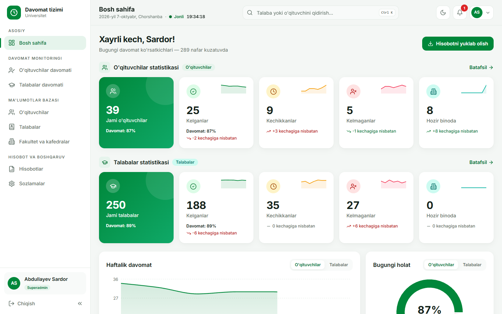
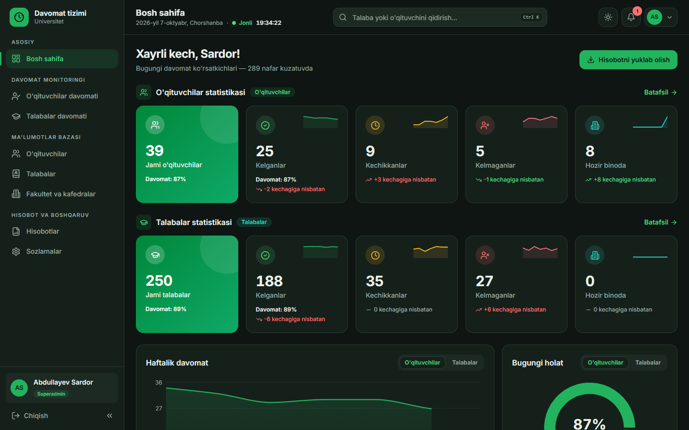
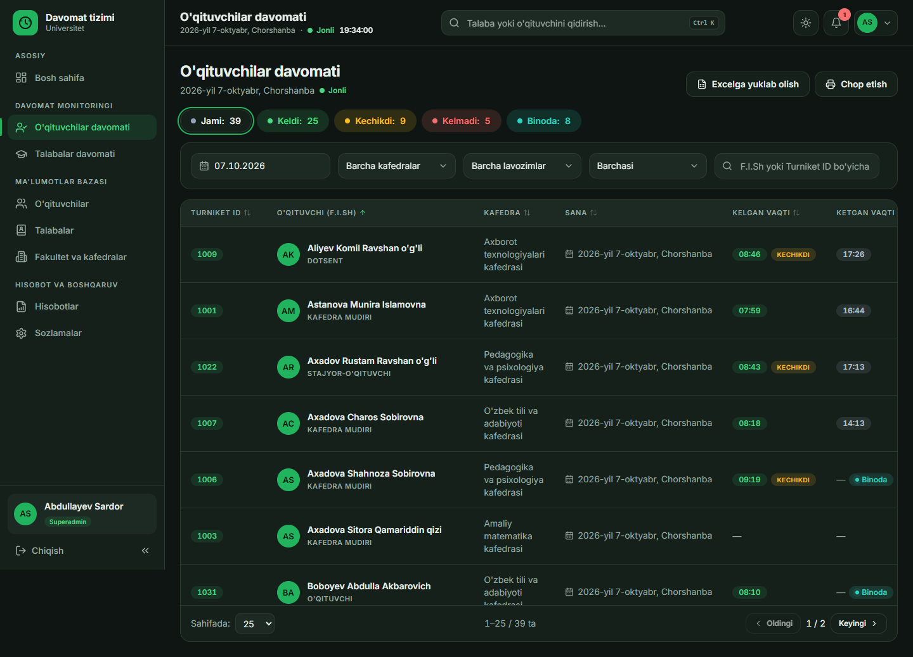
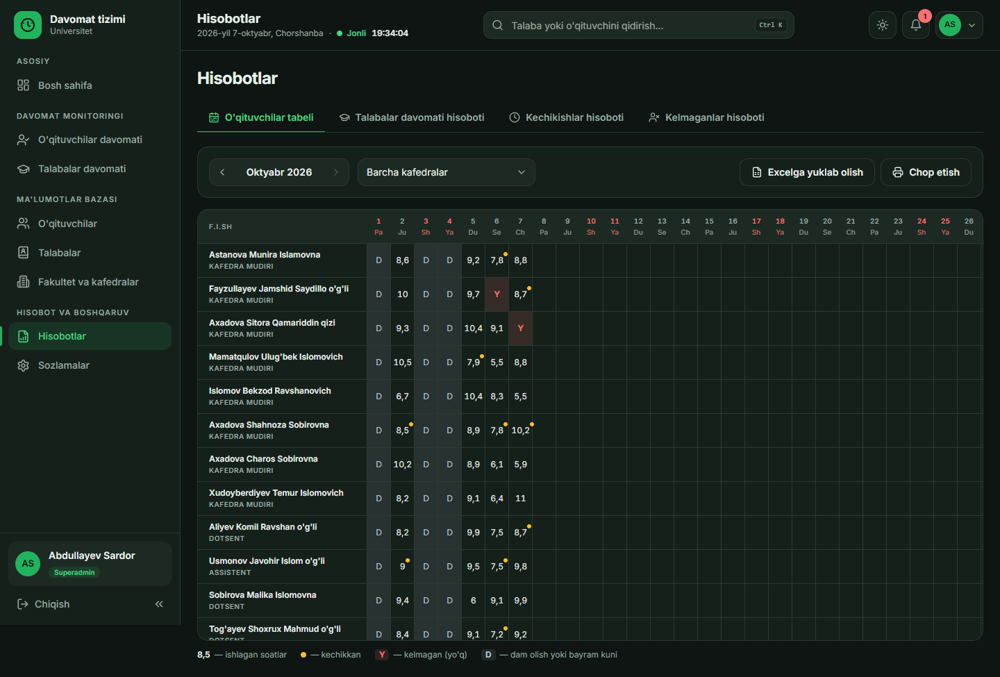
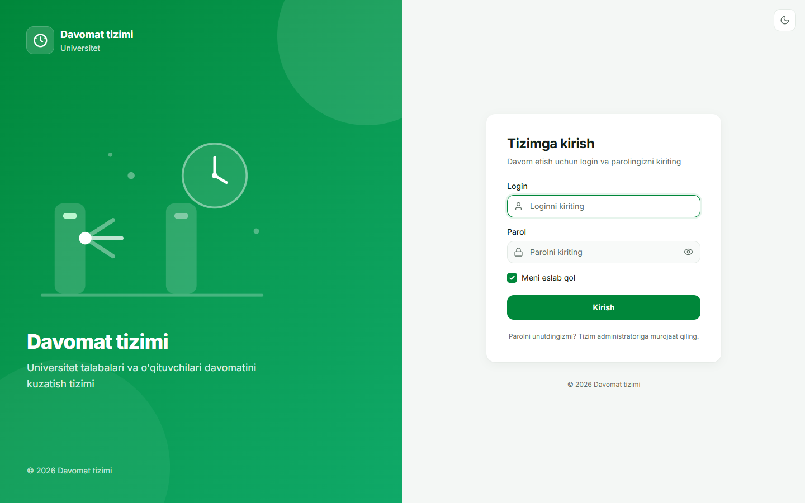

# Davomat tizimi — University Turnstile Attendance System

A web dashboard that tracks the daily attendance of **teachers and students** at a university campus, using entry/exit events from **Hikvision face & card turnstiles**. It was built for a university campus in Surxondaryo, Uzbekistan, and the whole interface is in **Uzbek (Latin script)**.

> **Status:** the frontend is complete and runs on realistic mock data. The backend that receives the turnstile events is the next stage of the project.



## Why it exists

The campus has 8 Hikvision turnstiles (4 for entry, 4 for exit). Teachers pass by face and students pass with ID cards. Every pass is pushed to the server in real time through Hikvision's *HTTP Listening* feature. This dashboard turns those raw events into data that management can use:

- who came on time, who was late and who is absent today;
- who is still inside the building and how long each teacher worked;
- a monthly teacher timesheet for payroll;
- attendance reports per group, plus rankings of late and absent people.

Teachers and students are tracked in **separate worlds**: separate menus, monitoring pages, databases and reports. Each turnstile event carries the person's *Employee No.*, which the system matches to a teacher or a student.

## Features

- **Live dashboard:** statistics cards with sparklines, a weekly trend chart, today's status donut, attendance by department, today's late and absent lists, and a live feed of recent passes.
- **Attendance monitoring:** separate pages for teachers and students, with:
  - date-range filters, status chips, sorting and pagination;
  - filters kept in the URL, so a refresh keeps them;
  - running "worked time" for people still inside.
- **Teacher and student databases:**
  - table and card views;
  - large validated forms with input masks (phone, passport, 14-digit JSHSHIR) and photo upload;
  - bulk actions (change group, move to the next course);
  - 3-step **Excel import** with cell-level validation.
- **Profiles:** full personal data and a colour-coded monthly attendance calendar with day tooltips, plus the raw pass history.
- **Reports:**
  - monthly teacher timesheet, printable on A4 landscape with signature lines;
  - group attendance report;
  - lateness and absence rankings, with absences split into excused and unexcused.
- **Roles:** Superadmin, Director and HR. Actions a role cannot use are hidden, passport data is masked, and forbidden URLs show an access-denied page.
- **Day / night themes:** built on CSS design tokens. Light and dark modes are checked for contrast against WCAG AA, and the theme follows the system preference on the first visit.
- **Exports:** every list and report can be downloaded as Excel and printed with print-friendly styles.
- **Responsive:** on phones the sidebar becomes a drawer, and tables scroll sideways with a sticky first column.
- **Own Uzbek date formatter:** for example "2026-yil 7-oktyabr, Chorshanba". The custom date pickers start the week on Monday.

| Dark theme | Teacher attendance |
|---|---|
|  |  |
| **Monthly timesheet** | **Login** |
|  |  |

## Tech stack

| | |
|---|---|
| **Language** | TypeScript |
| **UI** | React 18, React Router 6 |
| **Styling** | Tailwind CSS mapped to CSS-variable design tokens (light and dark) |
| **Charts** | Recharts |
| **Icons** | lucide-react |
| **Excel** | SheetJS (`xlsx`) for import and export |
| **Build** | Vite 5 |
| **Font** | Inter, with tabular numbers |

## Architecture

```
src/
├── pages/          # one file per screen
├── components/     # layout, shared widgets
│   └── ui/         # buttons, modals, date pickers, form controls, tabs...
├── services/api.ts # ← the ONLY data layer (async functions)
├── mock/           # mock data generator + attendance engine
├── context/        # auth, theme, toasts, live updates
├── utils/          # Uzbek date/number formatting, permissions, Excel, hooks
└── types/          # shared TypeScript types
```

All data goes through `src/services/api.ts`. For now its functions return mock data after a 300–600 ms delay. To connect the real backend, you only need to replace the bodies of these functions; the rest of the UI stays the same.

## Getting started

Requirements: **Node.js 18+**.

```bash
npm install
npm run dev        # http://localhost:5173
```

Demo accounts (mock only):

| Role | Login | Password |
|---|---|---|
| Superadmin | `superadmin` | `admin123` |
| Director | `direktor` | `direktor123` |
| HR department | `kadrlar` | `kadrlar123` |

Other commands:

```bash
npm run build      # type-check + production build into dist/
npm run preview    # serve the production build
```

A step-by-step guide in Russian is in [ZAPUSK.md](ZAPUSK.md).

## Roadmap

- [ ] Backend endpoint `POST /api/hikvision/events` to receive Hikvision HTTP Listening events
- [ ] Database for people, passes and settings
- [ ] Automatic sync of people (Employee No., card, face photo) to all 8 turnstiles via ISAPI
- [ ] Periodic pull of the event history from the devices to fill gaps after downtime

## Author

**Fayzullayev** — [github.com/fayzullayev-dev](https://github.com/fayzullayev-dev)
